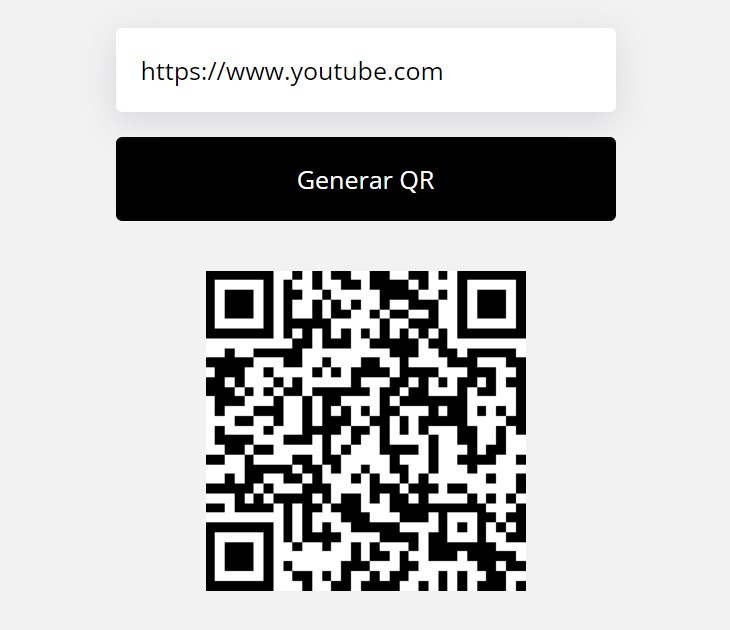

# Generador-de-QR-de-URLs
Generador que convierte links de sitios web en codigos QR, hecho en HTML, CSS y JavaScript

  
    
  
    
  
  

## ¿Cuál es el fin de este proyecto?
Es una simple pagina hecha en HTML, CSS y JavaScript. 
Su objetivo no es mas que el aprendisaje y practica de herramientas que nos puede proporcionar JavaScript para la creacioón de herramientas que nos puedan ayudar como 
los códigos QR..

## ¿Puedo Probarlo en Linea? 
Si, Puedes probarlo en linea haciendo click [aqui](https://carlosorellana00.github.io/Generador-de-QR-de-URLs/)

## ¿Cómo puedo probarlo de manera local en mi equipo?
puede copiarse directamente desde git a traves de comando o descargarse en un archivo Zip, el proyecto no requiere de ningun servicio de servidor para correrse
de manera local en una computadora.

## Modo de uso

Procedemos a abrir el programa y veremos un campo de texto y un botón 

  

Procedemos a copiar y pegar un link, en esta caso usaremos "youtube" 

  

  

procedemos a presionar el botón "generar QR"

  

  

y veremos como se creara un código QR 

  

## Agradecimientos y Referencias:

- [Autor Original -> FalconMaster](https://www.youtube.com/c/FalconMasters)
- [Video Original -> Como Generar Códigos QR con Javascript](https://www.youtube.com/watch?v=xWx9_GVHa_k)
